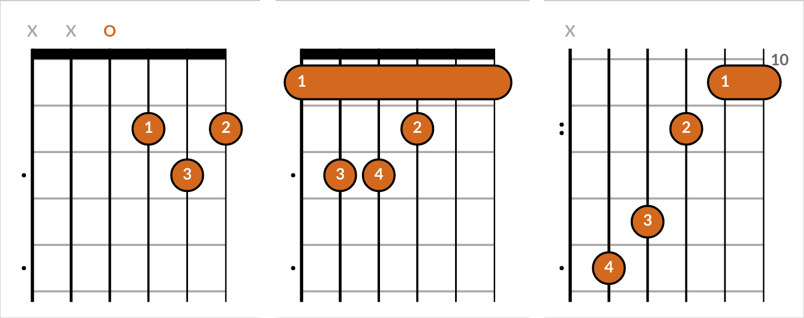

================
python-fretboard
================

Fretboard is a python library for generating SVG fretboard images and chord charts in Python.

Install
=======

::

    pip install fretboard

Usage
=====

Basic Examples
--------------

`Guitar chord <demo/svg/D.svg>`_::

    chord = fretboard.Chord(positions='xx0232', fingers='---132')
    chord.save('svg/D.svg')

`Bass chord <demo/svg/bass-E.svg>`_::

    chord = fretboard.BassChord(positions='x221', fingers='-321')
    chord.save('svg/bass-E.svg')

`Ukulele chord <demo/svg/ukulele-G.svg>`_::

    chord = fretboard.UkuleleChord(positions='x232', fingers='-132')
    chord.save('svg/ukulele-G.svg')

`Penatonic scale shape <demo/svg/pentatonic-shape.svg>`_::

    fb = fretboard.Fretboard(frets=(5, 8), style={'marker': {'color': 'dodgerblue'}})
    fb.add_marker(string=0, fret=5, label='A', color='chocolate')
    fb.add_marker(string=1, fret=5, label='D')
    fb.add_marker(string=2, fret=5, label='G')
    fb.add_marker(string=3, fret=5, label='C')
    fb.add_marker(string=4, fret=5, label='E')
    fb.add_marker(string=5, fret=5, label='A', color='chocolate')

    fb.add_marker(string=0, fret=8, label='C')
    fb.add_marker(string=1, fret=7, label='E')
    fb.add_marker(string=2, fret=7, label='A', color='chocolate')
    fb.add_marker(string=3, fret=7, label='D')
    fb.add_marker(string=4, fret=8, label='G')
    fb.add_marker(string=5, fret=8, label='C')
    fb.save('svg/pentatonic-shape.svg')

Demo
----

The `demo/` directory contains runnable examples that are served up in a web page.

::

    python-fretboard/demo $ pip install -r requirements.txt
    python-fretboard/demo $ invoke serve

Point your browser to http://localhost:8080 and check out the freshly rendered fretboards!
